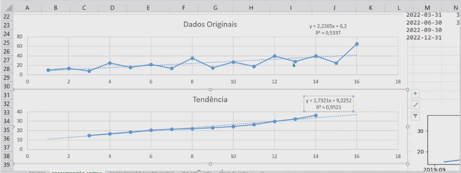

# usp-ds-series-temporais

# Aula 1

### Séries temporais
Passeio aleatório: gerar um comportamento similar para entendê-lo, de como ele poderia seguir. Caminhos possíveis, tem o livro 'O Andar do Bêbado', que traz o efeito aleatório nesse passeio.


Componentes de uma série temporal:
- Tendência: movimento oculto nos dados, seguindo uma direção (crescente, decrescente ou estacionária)
- Sazonal: flutuações regulares dentro de um período completo de tempo (dia, semana, mês, etc...).
- Cíclica: flutuações de longo prazo


## Como separo tendência da sazonalidade?

#### Método aditivo: Y = T + C + S + E
    - Y: valor da série no momento t
    - T: componente de tendência para o instante t 
    - C: componente cíclica para o instante t
    - S: componente sazonal para o instante t
    - E: componente aleatório para o instante t
    - usado em uma série mais 'mansa'

#### Método multiplicativo: Y = T * C * S * E

## Decomposição
Tendência: no excel é a média das médias móvel.


---
### Conceitos

1. **Y (Valor observado da série temporal no tempo t)**:
   - Representa o valor da série temporal no tempo específico t. É a soma (ou multiplicação, no caso multiplicativo) dos componentes subjacentes.

2. **T (Tendência)**:
   - Refere-se à direção geral de longo prazo da série temporal, que pode ser crescente, decrescente ou estável. A tendência é observada ao longo de períodos maiores, e pode ser influenciada por fatores estruturais (crescimento econômico, inovações tecnológicas, etc.).

3. **C (Componente Cíclica)**:
   - Reflete os movimentos repetitivos de longo prazo que não têm uma frequência fixa. Por exemplo, ciclos econômicos, que podem durar vários anos. É uma variação de longo prazo que não está associada à sazonalidade regular e pode ser mais difícil de identificar.

4. **S (Sazonalidade)**:
   - Este componente captura padrões que se repetem em intervalos regulares, como meses, trimestres ou dias da semana. A sazonalidade está frequentemente associada a comportamentos previsíveis, como picos de vendas no final do ano, alta no turismo no verão, ou aumentos no consumo de eletricidade durante o inverno.

5. **E (Erro ou Resíduo)**:
   - Este é o componente aleatório, que representa as variações inexplicáveis ou ruído no sistema. Ele pode ser causado por fatores imprevistos que não se encaixam nas outras categorias.

### Modelos Aditivo vs. Multiplicativo

- **Modelo Aditivo (Y = T + C + S + E)**: 
    - Aqui, as variações nos componentes são somadas. Este modelo é geralmente usado quando as variações sazonais e cíclicas permanecem aproximadamente constantes ao longo do tempo.
    - Exemplo: A quantidade de vendas de um pequeno mercado de bairro pode ter sazonalidade moderada, como um leve aumento nas vendas no inverno devido ao aumento no consumo de certos produtos.
    
- **Modelo Multiplicativo (Y = T * C * S * E)**:
    - Neste modelo, os componentes são multiplicados, o que indica que a magnitude das variações sazonais e cíclicas aumenta à medida que o nível da série temporal cresce.
    - Exemplo: Vendas de uma grande loja de departamentos onde, durante a temporada de festas, o impacto sazonal (picos de vendas) é muito mais pronunciado à medida que as vendas totais aumentam.

### Interpretação e Aplicações Reais

1. **Tendência (T)**:
   - A tendência pode indicar um crescimento ou declínio estrutural no desempenho de um negócio. Por exemplo, se a tendência de vendas de um e-commerce mostra um crescimento constante ao longo dos meses, isso pode sugerir uma expansão no mercado.
   - **Aplicação**: Uma empresa pode usar a análise de tendência para prever a demanda futura e ajustar sua capacidade de produção ou seu estoque.

2. **Componente Cíclica (C)**:
   - Ciclos refletem variações de longo prazo que podem estar associados a eventos econômicos, políticos ou de mercado.
   - **Aplicação**: Um banco pode usar a análise de ciclos para se preparar para períodos de recessão ou crescimento econômico, ajustando suas políticas de crédito.

3. **Sazonalidade (S)**:
   - A sazonalidade ajuda a prever padrões repetitivos. Um varejista pode usar esse componente para otimizar o estoque antes das festas de fim de ano, sabendo que as vendas aumentarão em dezembro.
   - **Aplicação**: Empresas de serviços de entrega podem ajustar suas operações para lidar com picos sazonais de demanda, como no Natal.

4. **Erro (E)**:
   - O componente aleatório pode ser útil para entender a variabilidade inesperada. Uma vez que ele é o "ruído", não é possível prever, mas se o erro for muito grande, pode ser um sinal de que outros fatores externos estão influenciando a série e devem ser analisados.
   - **Aplicação**: Se um analista perceber um aumento significativo na variabilidade, pode investigar eventos ou mudanças recentes que afetaram os dados.

### Como Utilizar no Dia a Dia

#### Exemplo 1: Planejamento de Estoques no Varejo
Imagine que você trabalha para uma empresa de varejo que vende artigos sazonais, como roupas de inverno. Ao decompor as vendas anuais usando um modelo aditivo, você identificará que há uma tendência de crescimento nas vendas, mas também uma sazonalidade forte entre novembro e fevereiro. Com essa informação, você ajusta seu estoque e campanhas de marketing para garantir que tenha produtos suficientes para suprir a demanda na alta temporada.

#### Exemplo 2: Previsão de Demanda de Energia
Em empresas de energia, a demanda pode ser decomposta em componentes como tendência (com o aumento de uso de eletrônicos), sazonalidade (picos no inverno e verão), e erros (por exemplo, interrupções inesperadas de fornecimento). Usando essa análise, a empresa pode ajustar sua produção e distribuir energia de forma mais eficiente.

### Considerações Finais
A decomposição das séries temporais é extremamente útil em áreas como marketing, produção, logística e planejamento estratégico. Ao separar os componentes, você consegue prever melhor o futuro e tomar decisões mais informadas com base nos padrões que estão por trás dos números.


## Cheat Sheet em Python

### 1. **Bibliotecas Principais**
Você precisará instalar e importar as seguintes bibliotecas:

```bash
pip install pandas numpy matplotlib statsmodels seaborn
```

```python
import pandas as pd
import numpy as np
import matplotlib.pyplot as plt
from statsmodels.tsa.seasonal import seasonal_decompose
```

### 2. **Carregar os Dados**
Vamos considerar que você tem uma série temporal em formato CSV. A primeira etapa é carregar os dados:

```python
# Carregar os dados da série temporal
df = pd.read_csv('caminho_para_seu_arquivo.csv', index_col='data', parse_dates=True)

# Exibir as primeiras linhas para garantir que os dados foram carregados corretamente
print(df.head())
```

### 3. **Decomposição Aditiva**
O método aditivo supõe que os componentes de tendência, sazonalidade e ruído são somados.

```python
# Decomposição Aditiva
decomp_aditiva = seasonal_decompose(df['sua_coluna'], model='additive', period=12)

# Plotar os componentes
decomp_aditiva.plot()
plt.show()
```

### 4. **Decomposição Multiplicativa**
O método multiplicativo assume que os componentes se multiplicam, geralmente usado quando a variação sazonal cresce com o nível da série.

```python
# Decomposição Multiplicativa
decomp_multiplicativa = seasonal_decompose(df['sua_coluna'], model='multiplicative', period=12)

# Plotar os componentes
decomp_multiplicativa.plot()
plt.show()
```

### 5. **Interpretando os Resultados**
A decomposição cria 4 componentes principais:
- **Observed**: A série original
- **Trend**: A tendência ao longo do tempo
- **Seasonal**: O padrão sazonal repetitivo
- **Residual**: O erro ou componente aleatório

Você pode acessar os componentes individualmente:

```python
# Acessando os componentes da decomposição aditiva
trend = decomp_aditiva.trend
seasonal = decomp_aditiva.seasonal
residual = decomp_aditiva.resid

# Exibir as primeiras linhas de cada componente
print(trend.head())
print(seasonal.head())
print(residual.head())
```

### 6. **Plotando Componentes Individualmente**

Para visualizar separadamente:

```python
# Plotar a tendência
plt.figure(figsize=(10,6))
plt.plot(trend)
plt.title('Componente de Tendência')
plt.show()

# Plotar a sazonalidade
plt.figure(figsize=(10,6))
plt.plot(seasonal)
plt.title('Componente Sazonal')
plt.show()

# Plotar o resíduo
plt.figure(figsize=(10,6))
plt.plot(residual)
plt.title('Componente Residual')
plt.show()
```

### 7. **Verificando a Estacionariedade**
Em séries temporais, pode ser importante verificar se a série é estacionária antes de aplicar outros modelos.

```python
from statsmodels.tsa.stattools import adfuller

# Teste de Dickey-Fuller Aumentado (ADF)
resultado_adf = adfuller(df['sua_coluna'])
print(f'Estatística do Teste ADF: {resultado_adf[0]}')
print(f'Valor-p: {resultado_adf[1]}')

# Checar se a série é estacionária
if resultado_adf[1] < 0.05:
    print('A série é estacionária')
else:
    print('A série não é estacionária')
```

### 8. **Salvar os Resultados**
Você pode salvar os componentes em arquivos CSV para análise posterior:

```python
# Salvando componentes em CSV
trend.to_csv('componente_tendencia.csv')
seasonal.to_csv('componente_sazonal.csv')
residual.to_csv('componente_residual.csv')
```

### 9. **Exemplo Completo de Código**

```python
import pandas as pd
import matplotlib.pyplot as plt
from statsmodels.tsa.seasonal import seasonal_decompose

# Carregar os dados
df = pd.read_csv('caminho_para_seu_arquivo.csv', index_col='data', parse_dates=True)

# Decomposição Aditiva
decomp_aditiva = seasonal_decompose(df['sua_coluna'], model='additive', period=12)

# Plotar os componentes
decomp_aditiva.plot()
plt.show()

# Exibir os componentes individualmente
trend = decomp_aditiva.trend
seasonal = decomp_aditiva.seasonal
residual = decomp_aditiva.resid

print("Trend:\n", trend.head())
print("Seasonal:\n", seasonal.head())
print("Residual:\n", residual.head())

# Verificar estacionariedade
from statsmodels.tsa.stattools import adfuller
resultado_adf = adfuller(df['sua_coluna'])
print(f'Estatística do Teste ADF: {resultado_adf[0]}')
print(f'Valor-p: {resultado_adf[1]}')

if resultado_adf[1] < 0.05:
    print('A série é estacionária')
else:
    print('A série não é estacionária')

# Salvar os resultados
trend.to_csv('componente_tendencia.csv')
seasonal.to_csv('componente_sazonal.csv')
residual.to_csv('componente_residual.csv')
```

### 10. **Ferramentas Alternativas**

- **`statsmodels`**: Principal biblioteca para decomposição de séries temporais.
- **`matplotlib`**: Para visualização dos componentes.
- **`pandas`**: Para manipulação e análise dos dados.

Com este cheat sheet, você tem as principais ferramentas para decompor séries temporais em Python, facilitando a análise de tendências, sazonalidade e ruídos em seus dados.

---
## Aula 2 - Prediçao


Para identificar uma tendência podemos utilizar: regressão ou médias móveis.

- ME (mean error)
- MAE (mean absolut error)
- RMSE (root mean square error)
- MPE (mean percentage error)
- MAPE (mean absolute percentage)

Em modelos preditivos para séries temporais, os erros são fundamentais para avaliar o desempenho e a precisão das previsões. Existem vários tipos de erros e métricas para medir a qualidade dos modelos, e sua interpretação ajuda a identificar onde e como o modelo pode ser aprimorado. Abaixo, exploramos os erros mais comuns e como interpretá-los.

### 1. **Tipos de Erros em Modelos de Séries Temporais**

Os erros são a diferença entre o valor observado e o valor previsto pelo modelo. Em termos matemáticos:

\[
Erro = Valor\_Observado - Valor\_Previsto
\]

Essa diferença pode ser usada para calcular várias métricas de desempenho, que fornecem diferentes perspectivas sobre a precisão do modelo.

### 2. **Métricas Comuns de Erro**

#### 2.1 **Erro Médio Absoluto (MAE - Mean Absolute Error)**

O **MAE** é a média dos valores absolutos das diferenças entre o valor observado e o valor previsto. Ele mede o tamanho médio dos erros, sem considerar a direção (positiva ou negativa).

\[
MAE = \frac{1}{n} \sum_{t=1}^{n} |Valor\_Observado_t - Valor\_Previsto_t|
\]

- **Interpretação**: Quanto menor o valor do MAE, mais preciso é o modelo. Como é uma métrica em unidades originais da série, pode ser mais fácil de interpretar no contexto do problema.
- **Exemplo**: Se o MAE de um modelo de previsão de vendas é 100 unidades, significa que, em média, o modelo erra em 100 unidades para cima ou para baixo.

#### 2.2 **Erro Quadrático Médio (MSE - Mean Squared Error)**

O **MSE** eleva ao quadrado os erros antes de calcular a média, o que penaliza erros maiores mais severamente do que erros menores.

\[
MSE = \frac{1}{n} \sum_{t=1}^{n} (Valor\_Observado_t - Valor\_Previsto_t)^2
\]

- **Interpretação**: O MSE amplifica os erros maiores, sendo útil para destacar previsões com grandes desvios. Um valor de MSE muito alto indica que o modelo pode estar cometendo erros significativos em alguns pontos.
- **Exemplo**: Um MSE alto pode indicar que o modelo está subestimando ou superestimando muito em certas partes da série temporal.

#### 2.3 **Raiz do Erro Quadrático Médio (RMSE - Root Mean Squared Error)**

O **RMSE** é a raiz quadrada do MSE. Ele é útil porque coloca o erro de volta na mesma escala dos dados originais, facilitando a interpretação.

\[
$RMSE = \sqrt{\frac{1}{n} \sum_{t=1}^{n} (Valor\_Observado_t - Valor\_Previsto_t)^2}$
\]

- **Interpretação**: O RMSE, assim como o MSE, é sensível a grandes erros, mas seu valor está na mesma unidade dos dados, o que facilita a comparação. Valores menores indicam um modelo mais preciso.
- **Exemplo**: Se o RMSE de um modelo de previsão de temperatura é 2°C, isso significa que, em média, o modelo erra por 2°C em suas previsões.

#### 2.4 **Erro Percentual Absoluto Médio (MAPE - Mean Absolute Percentage Error)**

O **MAPE** mede o erro percentual médio, o que o torna independente da unidade de medida e facilita a comparação entre diferentes séries temporais.

\[
$MAPE = \frac{100}{n} \sum_{t=1}^{n} \left| \frac{Valor\_Observado_t - Valor\_Previsto_t}{Valor\_Observado_t} \right|$
\]

- **Interpretação**: O MAPE indica a porcentagem média de erro em relação ao valor real. Um valor de MAPE de 10% significa que, em média, o modelo está errando por 10% do valor real.
- **Exemplo**: Se o MAPE em um modelo de previsão de vendas é 5%, isso significa que, em média, o modelo erra 5% do valor real de vendas.

#### 2.5 **Erro de Previsão Simples (Bias)**

O **bias** mede se o modelo está, consistentemente, superestimando ou subestimando as previsões.

\[
$Bias = \frac{1}{n} \sum_{t=1}^{n} (Valor\_Previsto_t - Valor\_Observado_t)$
\]

- **Interpretação**: Um bias positivo indica que o modelo tende a superestimar os valores, enquanto um bias negativo indica que o modelo subestima. O bias é útil para identificar tendências sistemáticas de erro.
- **Exemplo**: Um bias de -20 em um modelo de previsão de temperatura indica que o modelo, em média, subestima a temperatura em 20 unidades.

### 3. **Como Interpretar Erros e Melhorar Modelos**

#### 3.1 **Erros Pequenos e Consistentes**
Se as métricas indicarem erros pequenos e consistentes (como baixo MAE, RMSE e MAPE), o modelo está capturando bem os padrões da série temporal. Nesse caso, ele pode ser usado com confiança para previsões futuras.

#### 3.2 **Erros Grandes ou Inconsistentes**
Erros grandes ou inconsistentes podem sugerir que o modelo não está capturando adequadamente certas variações, como:
- **Mudanças bruscas (outliers)**: O modelo pode estar sendo influenciado por eventos inesperados que não são explicados pelos dados históricos.
- **Sazonalidade ou tendências mal modeladas**: O modelo pode não estar capturando adequadamente padrões sazonais ou tendências de longo prazo.

#### 3.3 **Overfitting e Underfitting**
- **Overfitting**: O modelo se ajusta muito bem aos dados históricos (erros muito baixos no treino), mas não generaliza bem para novos dados. Isso pode ser identificado por um erro de teste muito maior que o erro de treino.
- **Underfitting**: O modelo não captura bem os padrões dos dados, levando a um erro elevado tanto no treino quanto no teste.

#### 3.4 **Uso de Erros para Ajustar Modelos**
- **Avaliar hiperparâmetros**: Se os erros estão elevados, ajustar os hiperparâmetros do modelo (como a regularização ou o número de lags) pode ajudar a melhorar o desempenho.
- **Verificar a estacionariedade**: Se a série temporal não for estacionária (varia ao longo do tempo), pode ser necessário aplicar transformações como diferenciação para estabilizar a série antes de ajustar o modelo.
- **Adicionar novos recursos**: Incorporar variáveis externas, como eventos econômicos ou informações climáticas, pode ajudar a melhorar a precisão.

### 4. **Exemplo em Python: Avaliando um Modelo ARIMA**

```python
from statsmodels.tsa.arima.model import ARIMA
from sklearn.metrics import mean_absolute_error, mean_squared_error
import numpy as np

# Ajustar o modelo ARIMA
model = ARIMA(df['sua_coluna'], order=(1, 1, 1))
model_fit = model.fit()

# Previsões
previsoes = model_fit.predict(start=len(df), end=len(df) + 12, typ='levels')

# Cálculo do MAE, MSE e RMSE
mae = mean_absolute_error(df['sua_coluna'][-12:], previsoes)
mse = mean_squared_error(df['sua_coluna'][-12:], previsoes)
rmse = np.sqrt(mse)

print(f'MAE: {mae}')
print(f'MSE: {mse}')
print(f'RMSE: {rmse}')
```

### 5. **Conclusão**

Interpretar os erros é essencial para entender o desempenho do modelo de séries temporais. Cada métrica tem um papel específico na avaliação, ajudando a identificar pontos fortes e fracos das previsões. Em aplicações práticas, usar essas métricas permite ajustar o modelo de forma iterativa para melhorar sua precisão.

O **Índice de Theil** (ou **U de Theil**) é uma métrica utilizada em séries temporais para comparar a precisão de previsões em relação a um modelo de referência, como um modelo ingênuo (que simplesmente prevê o próximo valor da série com base no último valor observado). Ele ajuda a avaliar o quão bem um modelo preditivo está funcionando em comparação a uma previsão simples.

### Fórmula do Índice de Theil

O índice de Theil é calculado da seguinte maneira:

\[
$U = \frac{\sqrt{\frac{1}{n} \sum_{t=1}^{n} (Valor\_Previsto_t - Valor\_Observado_t)^2}}{\sqrt{\frac{1}{n} \sum_{t=1}^{n} (Valor\_Observado_t - Valor\_Observado\_Anterior_t)^2}}$
\]

Aqui:
- \( Valor\_Previsto_t \) é o valor previsto pelo modelo no tempo t.
- \( Valor\_Observado_t \) é o valor observado no tempo t.
- \( Valor\_Observado\_Anterior_t \) é o valor observado no tempo anterior \(t-1\), utilizado como previsão ingênua.

### Interpretação do Índice de Theil

- **U = 1**: O modelo preditivo tem a mesma precisão que um modelo ingênuo, ou seja, prever o próximo valor simplesmente usando o valor anterior.
- **U < 1**: O modelo preditivo está funcionando melhor do que o modelo ingênuo. Quanto mais próximo de 0, melhor é a previsão.
- **U > 1**: O modelo preditivo está funcionando pior do que o modelo ingênuo. Isso indica que as previsões do modelo são menos precisas do que simplesmente usar o último valor observado como previsão.

### Aplicações do Índice de Theil

- **Comparação de modelos**: Ele é muito útil quando você deseja comparar a qualidade de diferentes modelos de previsão, já que fornece uma medida relativa de desempenho.
- **Avaliação de modelos complexos**: Pode ser usado para verificar se um modelo mais complexo (como um modelo ARIMA ou SARIMA) está realmente trazendo melhorias em relação a previsões mais simples, como o modelo de média móvel ou o modelo ingênuo.

### Exemplo de Cálculo em Python

Vamos ver como calcular o Índice de Theil usando Python. Para isso, usaremos as previsões feitas por um modelo e os valores observados.

```python
import numpy as np

# Valores observados (exemplo)
observado = np.array([100, 102, 105, 107, 110])

# Valores previstos pelo modelo
previsto = np.array([101, 103, 104, 108, 109])

# Modelo ingênuo: prever que o próximo valor será o último valor observado
naive = np.roll(observado, shift=1)  # Desloca os valores observados para simular a previsão ingênua
naive[0] = observado[0]  # Corrige o primeiro valor, que não tem um valor anterior para prever

# Cálculo do numerador do índice de Theil (erro do modelo preditivo)
numerador = np.sqrt(np.mean((previsto - observado)**2))

# Cálculo do denominador do índice de Theil (erro do modelo ingênuo)
denominador = np.sqrt(np.mean((observado - naive)**2))

# Índice de Theil
indice_theil = numerador / denominador
print(f'Índice de Theil: {indice_theil}')
```

### Interpretação dos Resultados

- Se o valor do **Índice de Theil** calculado for menor que 1, isso significa que o modelo preditivo é melhor do que o modelo ingênuo.
- Se o valor for maior que 1, o modelo preditivo é pior que o modelo ingênuo, e ajustes são necessários.

### Exemplo Prático

#### Previsão de Vendas no Varejo
Em uma empresa de varejo, ao comparar o desempenho de um modelo SARIMA de previsão de vendas com um modelo ingênuo, você pode calcular o Índice de Theil. Se o valor de Theil for menor que 1, isso indicaria que o modelo SARIMA está melhorando a precisão das previsões em relação a simplesmente usar o valor de vendas do mês anterior. Se for maior que 1, o modelo SARIMA precisaria ser ajustado ou até substituído por um modelo mais simples.

### Considerações Finais

O **Índice de Theil** é uma métrica útil para comparar a eficácia de modelos preditivos, principalmente em séries temporais. Ele ajuda a entender se a complexidade de um modelo justifica seu uso ou se um modelo simples seria igualmente eficaz.

---

## Métodos simples de previsão
- Naive: projeta o último valor para o futuro
- Naive Sazonal: considera o último valor do mesmo período de tempo (séries com sazonalidade)
- Média: média histórica como previsão para o futuro
- Drift: previsão com base na tendência da série (como traçar uma reta entre o primeiro e o último ponto)

## Modelos de suavização exponencial (smooth)

### **Smooth Exponential Models for Time Series Analysis**

Smooth exponential models are part of a family of forecasting methods that apply weighted averages to past observations, giving more weight to more recent data points. These methods are widely used for time series forecasting because of their simplicity, adaptability, and effectiveness in handling different types of time series patterns such as trends and seasonality. 

Here are the **main models** within the exponential smoothing framework:

### 1. **Simple Exponential Smoothing (SES)**
#### **Overview:**
- Simple Exponential Smoothing is used for time series data without any trend or seasonality.
- The model gives exponentially decreasing weights to older observations, which means the recent data points have more influence on the forecast.

#### **Formula:**
\[
S_t = \alpha X_t + (1 - \alpha) S_{t-1}
\]
Where:
- \(S_t\) is the smoothed value (forecast for time \(t+1\)).
- \(\alpha\) is the smoothing factor (between 0 and 1).
- \(X_t\) is the actual value at time \(t\).

#### **Best Applications:**
- Stationary series (no trend or seasonality).
- Examples: Inventory levels, stock prices without trends.

#### **Interpretation of Results:**
- SES provides a smoothed value that represents the expected value for the next period.
- If \(\alpha\) is small, the model responds slowly to recent changes. If \(\alpha\) is large, the model reacts more quickly to new data.
  
---

### 2. **Holt’s Linear Trend Model (Double Exponential Smoothing)**
#### **Overview:**
- Holt’s Linear Trend Model is an extension of Simple Exponential Smoothing that accounts for **trend** in the data.
- It consists of two components: the level (similar to SES) and the trend.

#### **Formula:**
- **Level equation:**
  \[
  L_t = \alpha X_t + (1 - \alpha)(L_{t-1} + T_{t-1})
  \]
- **Trend equation:**
  \[
  T_t = \beta (L_t - L_{t-1}) + (1 - \beta)T_{t-1}
  \]
- **Forecast equation:**
  \[
  F_{t+k} = L_t + k T_t
  \]
Where:
- \(L_t\) is the level component at time \(t\).
- \(T_t\) is the trend component at time \(t\).
- \(\alpha\) and \(\beta\) are the smoothing parameters for the level and trend, respectively.

#### **Best Applications:**
- Series with a **trend** but **no seasonality**.
- Examples: Sales growth over time, demand forecasting for trending products.

#### **Interpretation of Results:**
- The forecast is a combination of the level and trend. It predicts future values based on the current level and the direction of the trend.
- A large value for \(\beta\) indicates a model that quickly adjusts to changes in trend.

---

### 3. **Holt-Winters Seasonal Model**
#### **Overview:**
- The Holt-Winters model extends Holt’s Linear Trend Model by adding a **seasonal** component, making it suitable for data with both trend and seasonality.
- There are two variations: **additive** (when seasonal variations are constant) and **multiplicative** (when seasonal variations change proportionally to the trend).

#### **Formulas (Additive Model):**
- **Level equation:**
  \[
  L_t = \alpha \frac{X_t}{S_{t-s}} + (1 - \alpha)(L_{t-1} + T_{t-1})
  \]
- **Trend equation:**
  \[
  T_t = \beta (L_t - L_{t-1}) + (1 - \beta)T_{t-1}
  \]
- **Seasonal equation:**
  \[
  S_t = \gamma \frac{X_t}{L_t} + (1 - \gamma)S_{t-s}
  \]
- **Forecast equation:**
  \[
  F_{t+k} = (L_t + k T_t) S_{t+k-s}
  \]
Where:
- \(S_t\) is the seasonal component at time \(t\).
- \(s\) is the number of periods in a seasonal cycle (e.g., 12 for monthly data with yearly seasonality).
- \(\gamma\) is the smoothing parameter for seasonality.

#### **Best Applications:**
- Series with both a **trend and seasonality**.
- Examples: Retail sales with monthly peaks, temperature forecasting, tourism demand.

#### **Interpretation of Results:**
- The forecast includes adjustments for both the trend and seasonality. The seasonal component cycles regularly, while the trend adjusts over time.
- The **additive model** works well when seasonal effects are roughly constant, while the **multiplicative model** is useful when the amplitude of seasonality grows with the trend.

---

### **Choosing the Right Model:**
1. **No trend or seasonality**: Use **Simple Exponential Smoothing (SES)**.
2. **Trend but no seasonality**: Use **Holt’s Linear Trend Model**.
3. **Trend and seasonality**: Use the **Holt-Winters Seasonal Model**.

### **Result Interpretation for Series with Trend and Seasonality**
- **Trend Interpretation**: Positive trends indicate growth, while negative trends indicate decline over time.
- **Seasonal Interpretation**: Regular fluctuations represent recurring patterns. For example, retail sales may spike in December due to holiday shopping.
  
### **Practical Tips:**
- **Model Fit**: Check metrics like Mean Absolute Error (MAE), Mean Squared Error (MSE), or Akaike Information Criterion (AIC) to compare model fit.
- **Stationarity**: Before applying, ensure the data behaves consistently. Non-stationary data may need transformations, such as differencing, before applying smoothing methods.
- **Hyperparameter Tuning**: Adjust smoothing parameters (\(\alpha\), \(\beta\), and \(\gamma\)) to optimize the forecast accuracy.

These models provide effective tools to forecast time series with varying complexity and patterns, from simple, non-trending data to complex series with trend and seasonal effects.

---

## ETS

### **ETS Model (Error, Trend, Seasonal)**

The **ETS model** is a powerful approach to time series forecasting that stands for **Error, Trend, and Seasonality**. It is a general framework for exponential smoothing that models these three components explicitly. The ETS framework includes a variety of models that can capture different types of behaviors in time series data, and it can be used to model a wide range of patterns, including those with trends, seasonality, or no seasonality at all.

### **Components of the ETS Model**

The ETS framework is based on three main components:
1. **Error (E)**: Refers to how the model deals with residuals or errors (additive or multiplicative).
2. **Trend (T)**: Refers to whether the series has a trend component and how it behaves (none, additive, multiplicative, or damped).
3. **Seasonality (S)**: Refers to whether the series has seasonality and how it behaves (none, additive, or multiplicative).

Each of these components can be modeled in different ways, which leads to a wide variety of possible models under the ETS framework. The model is often denoted as **ETS(A, T, S)**, where:
- **A**: Additive (used for both Error, Trend, or Seasonality).
- **M**: Multiplicative (used for Error, Trend, or Seasonality).
- **N**: None (used for Trend or Seasonality).

For example, **ETS(A, A, A)** would be a model with additive error, additive trend, and additive seasonality.

### **ETS Model Structure**

An ETS model typically has three equations:
1. **Level equation**: Governs the overall level of the series.
2. **Trend equation**: Governs the change in the level over time.
3. **Seasonality equation**: Captures recurring patterns at regular intervals.

For instance, in the additive ETS(A, A, A) model, the equations look like this:

1. **Level**: \(L_t = \alpha (Y_t - S_{t-m}) + (1 - \alpha) (L_{t-1} + T_{t-1})\)
2. **Trend**: \(T_t = \beta (L_t - L_{t-1}) + (1 - \beta) T_{t-1}\)
3. **Seasonal**: \(S_t = \gamma (Y_t - L_{t}) + (1 - \gamma) S_{t-m}\)

Where:
- \(Y_t\) is the observed value at time \(t\).
- \(L_t\) is the level component at time \(t\).
- \(T_t\) is the trend component.
- \(S_t\) is the seasonal component.
- \(m\) is the seasonal period.
- \(\alpha, \beta, \gamma\) are the smoothing parameters for the level, trend, and seasonality respectively.

### **ETS Model Variations**

The ETS framework includes several model variations based on the components. Here are some common ETS models:

1. **ETS(A, N, N)**: Additive error, no trend, and no seasonality (Simple Exponential Smoothing).
2. **ETS(A, A, N)**: Additive error, additive trend, no seasonality (Holt’s Linear Trend Model).
3. **ETS(A, A, A)**: Additive error, additive trend, and additive seasonality (Additive Holt-Winters).
4. **ETS(A, M, A)**: Additive error, multiplicative trend, and additive seasonality.
5. **ETS(M, A, A)**: Multiplicative error, additive trend, and additive seasonality.

---

### **When to Use the ETS Model**

The ETS model is highly flexible and can be applied to a wide range of time series with different behaviors. The key to choosing the right ETS model is to understand the underlying structure of your data:

1. **No Trend or Seasonality**: Use a model like ETS(A, N, N) if your data is stationary (i.e., has no clear trend or seasonality).
   
2. **Trend Only**: If the data has a trend but no seasonality, models like ETS(A, A, N) (additive trend) or ETS(A, M, N) (multiplicative trend) work well.

3. **Seasonality Only**: Use ETS(A, N, A) or ETS(A, N, M) if the data has seasonality but no trend.

4. **Trend and Seasonality**: For data that shows both trend and seasonality, models like ETS(A, A, A) or ETS(A, M, A) are appropriate.

The multiplicative versions (e.g., ETS(A, M, A)) are useful when the size of the trend or seasonality increases proportionally with the level of the series. Additive models are used when the size of the trend or seasonal variation stays constant.

---

### **How to Implement the ETS Model in Python**

We can use the `statsmodels` library to fit an ETS model. Here's an example:

#### **Python Example for ETS Model:**

```python
import pandas as pd
import numpy as np
import matplotlib.pyplot as plt
from statsmodels.tsa.holtwinters import ExponentialSmoothing

# Sample data with trend and seasonality
np.random.seed(42)
periods = 120
seasonal_pattern = 10 + 5 * np.sin(np.linspace(0, 24, periods))
data = seasonal_pattern + np.arange(1, periods + 1) + np.random.normal(0, 3, periods)
df = pd.DataFrame(data, columns=["Value"])

# Fit an ETS model (additive trend, additive seasonality)
model = ExponentialSmoothing(df['Value'], trend='add', seasonal='add', seasonal_periods=12).fit()
df['ETS_Forecast'] = model.fittedvalues

# Forecast future values
forecast = model.forecast(24)

# Plot the results
plt.plot(df['Value'], label="Original Data")
plt.plot(df['ETS_Forecast'], label="ETS Fitted Values", color='red')
plt.plot(range(len(df), len(df) + 24), forecast, label="ETS Forecast", color='green')
plt.legend()
plt.show()
```

#### **Summary of ETS Model Output:**

1. **Fitted Values**: The ETS model provides smoothed values for each point in the time series, capturing the underlying pattern (level, trend, and seasonality).
   
2. **Trend**: The trend component reflects whether the time series is increasing or decreasing over time. If the trend is positive, the series is expected to increase over time.

3. **Seasonality**: If seasonality is present, the model identifies periodic patterns. The seasonal component shows how much each observation deviates from the trend due to seasonal factors.

4. **Forecasts**: The model provides future predictions based on the identified components. The forecast is a combination of the level, trend, and seasonal components projected forward.

---

### **Tips for Interpreting ETS Model Results**

1. **Check the Residuals**: After fitting the model, examine the residuals (the difference between the actual and fitted values). Ideally, residuals should show no clear pattern and be normally distributed, indicating that the model has captured all the systematic patterns in the data.

2. **Model Diagnostics**: Use metrics like AIC (Akaike Information Criterion) or BIC (Bayesian Information Criterion) to assess model fit. Lower values indicate a better model.

3. **Seasonality and Trend Analysis**: Analyze the trend and seasonal components separately. This can help you understand whether your data is influenced more by long-term trends or short-term seasonal fluctuations.

4. **Stationarity and Damping**: If your time series shows a trend but the trend seems to flatten over time, consider using a **damped trend** model, which captures trends that become less pronounced over time.

---

### **Go Further with ETS Model Data Analysis**

1. **Optimize the Model**: The `statsmodels` library automatically optimizes the smoothing parameters (\(\alpha\), \(\beta\), \(\gamma\)). However, you can also manually adjust these parameters to see how they impact the model's performance.

2. **Cross-Validation**: Use techniques like walk-forward validation to check how well the model performs on unseen data. Split your time series into training and test sets to validate model accuracy.

3. **Model Selection**: If you have multiple candidate models, compare their AIC and BIC values to choose the best-fitting model.

4. **Combine Models**: If your data is very complex, you can combine ETS with other models (e.g., ARIMA) to capture additional patterns. This hybrid approach is particularly useful in high-variance data.

The **ETS model** offers a versatile and interpretable way to model time series data with trend and seasonal components, making it highly valuable for forecasting tasks in various industries, such as sales, inventory, and economic data.

